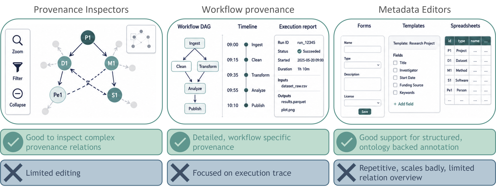
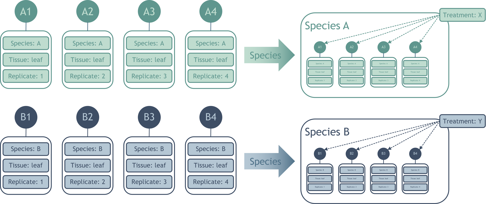
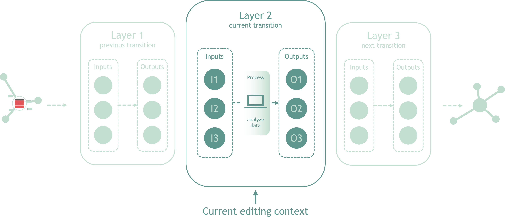

---

title: 'Contigo: Relation-preserving grouped editing for FAIR provenance'
title_short: 'Contigo'
tags:
  - ARC
  - metadata
  - tooling
authors:
  - name: Caroline Ott
    orcid: https://orcid.org/0000-0003-1512-9504
    affiliation: 1
    role: Concept, development
  - name: Annika Paul
    orcid: https://orcid.org/0009-0008-7417-0965
    affiliation: 1
    role: Development
affiliations:
  - name: Computational Systems Biology, Rheinland-Pfälzische Technische Universität Kaiserslautern-Landau, Kaiserslautern, Germany
    index: 1
date: 2026-06-22

---

# Contigo: Relation-preserving grouped editing for FAIR provenance

Contigo is a concept and prototype for a “tableless” table editor for FAIR provenance annotation. It addresses a recurring practical problem in ARC-related metadata work: researchers need to describe many samples, files, process steps, replicates, and input-output relations in a structured and interoperable way, but the available editing views often force them either into repetitive table editing or into graph views that are useful for inspection but less suitable for continuous editing.

## Motivation / Problem

Scientific data management increasingly treats research outputs not only as files, but as reusable digital objects whose content, context, and provenance should be understandable by both humans and machines. In the ARC ecosystem, this means that experimental and computational work should be documented with structured metadata, ontology-backed annotation, and explicit provenance relations.

Existing tools address important parts of this problem:

* Metadata editors provide good support for structured and ontology-backed annotation, but editing can become repetitive and scale badly when many entities share the same values.
* Provenance viewers and inspectors are useful for understanding complex relations, but they are usually optimized for exploration rather than authoring.
* Workflow provenance systems can record detailed execution traces, but they are often workflow-specific and provide limited support for manual, iterative metadata editing.

The remaining gap is an editing interface that preserves explicit provenance relations while allowing users to work at a higher level of abstraction. In practice, users often want to say “these four samples are species A”, “these outputs belong to this treatment group”, or “this process connects this input group to that output group”, without manually repeating the same annotation or creating every individual edge.

Contigo addresses this gap by making groups, transition layers, and relation summaries editable interface elements while keeping the underlying entity-level provenance recoverable.

## Proposed Solution

Contigo proposes relation-preserving grouped editing for FAIR provenance. The central idea is to let users edit structured metadata and provenance relations through visible groups and local transition contexts instead of through one large table or one global graph.

The approach combines four interaction concepts.

### Grouped metadata editing

Entities can be grouped by shared properties, such as species, tissue, treatment, replicate set, input type, or output type. Shared annotations can then be entered once at the group level rather than repeatedly for every entity.

For example, instead of annotating each individual replicate with the same species and tissue values, users can create a visible group such as “Species A / leaf samples” and assign shared metadata to the group. The system still keeps track of the concrete entities inside the group, so group-level edits can be resolved into explicit entity-level metadata.

Group-level editing should not hide exceptions. If one member of a group differs from the others, the exception must remain accessible and editable without breaking the overall group structure.

### Local transition-layer editing

Rather than displaying the full provenance graph at once, Contigo organizes editing around transition layers. A transition layer represents a local provenance step with inputs, a process, and outputs.

This allows users to focus on the currently relevant transformation while still keeping the layer connected to the larger provenance chain. Previous and next layers can be shown in collapsed form, so users retain orientation without being forced to inspect the whole graph.

A typical editing context contains:

* current inputs
* the current process or activity
* current outputs
* collapsed upstream context
* expandable access to the detailed relations behind the visible summary

Contextual propagation allows information from upstream entities to inform grouping and editing in the current layer. For example, sample-level annotations from an earlier step can be propagated into a later editing context so that users can group or filter outputs by upstream properties without expanding the complete provenance history.

This reduces visual clutter while keeping provenance explicit and inspectable.

## Constraints and Discussion

The main design constraint is that groups must remain interface abstractions, not replacements for provenance. Contigo should make editing easier without weakening the underlying data model.

Several constraints follow from this principle:

* Group-level annotations must be resolvable to concrete entities.
* Collapsed context must remain traceable.
* Relation summaries must be expandable.
* Ambiguous mappings must not be guessed.
* Ontology-backed metadata should remain compatible with ARC and ISA expectations.

A second constraint is usability. The interface should reduce the cognitive load of large tables and dense graphs, but it should not create a hidden model that users cannot inspect. For this reason, the proposed interaction model keeps the current transition visible and uses collapse, grouping, and summaries only where they improve editing.

A third constraint is iterative work. Provenance annotation is not always completed in one pass. Users may begin with coarse groupings, add metadata later, split groups, resolve exceptions, or refine mappings as more information becomes available. Contigo should therefore support continuous editing rather than a single import-export workflow.

### User interface components

The current prototype direction includes component-based previews through [Storybook](https://nfdi4plants.github.io/Swate/?path=/docs/gettingstarted--docs). Relevant UI components include:

* group views for shared metadata
* transition-layer views for input-process-output editing
* collapsed context nodes
* expandable relation summaries
* detail panels for member-level exceptions
* ontology-aware metadata input components
* preview and validation feedback components
