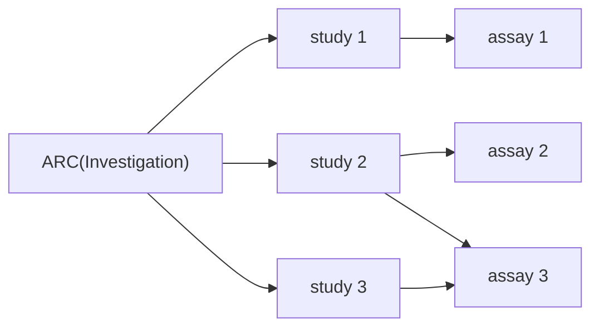

# ARC Process GraphViz

## Goal

- Visualize flow of (experimental) samples / processes in an ARC
  - Sample-to-sample-to-data(-to-result)
- List studies and assays of an ARC
  1. Detail 1: Which assay is linked to which study?
  2. Detail 2: Which sample goes through which study (processes) and assay (processes) (to which workflow)
- Interactive (add remove complexity, detail)

### highest-level (ISA registration)

## Code base

1. Read / wrangle ARC metadata model
   1. ARCtrl - read ARC
   2. find overlapping samples between ISA processes
2. Visualize / Graph
   1. Cytoscape, Cy.js
   2. Obsidian
   3. Plotly

## 

## Additional / Future

- computational workflows

