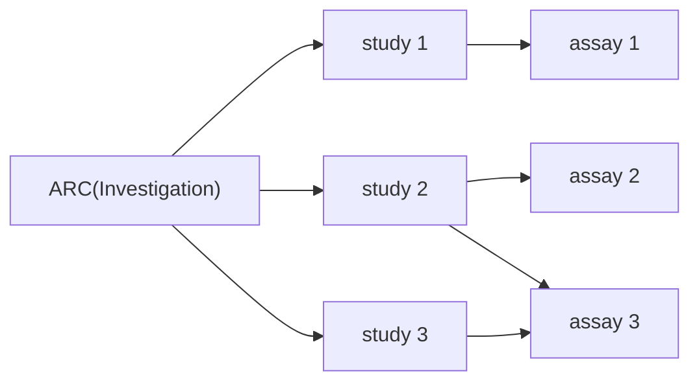
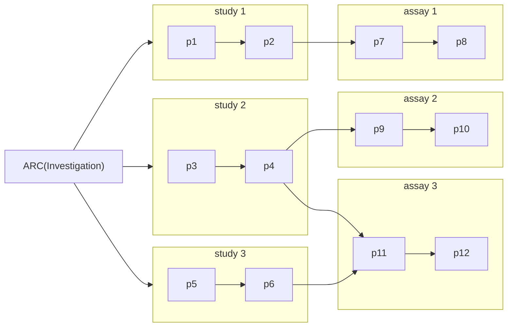
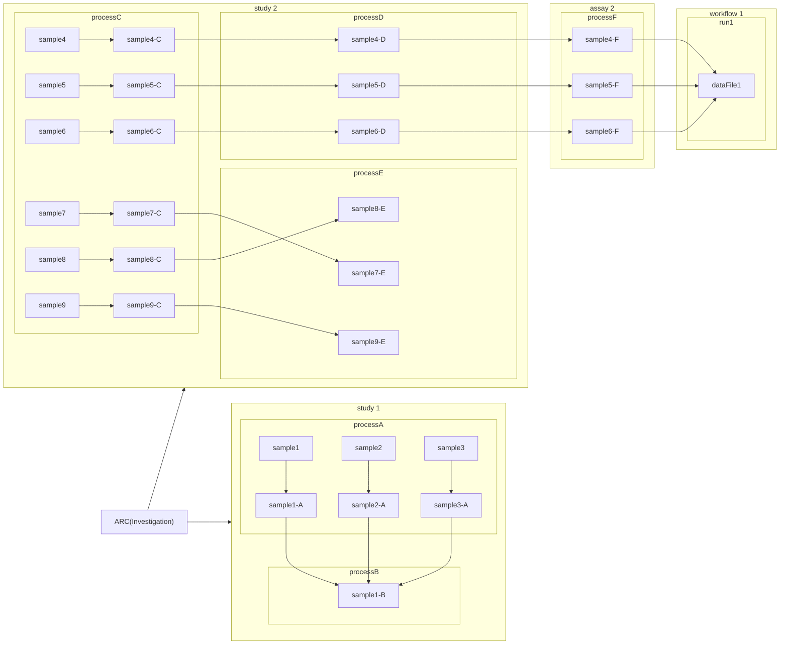
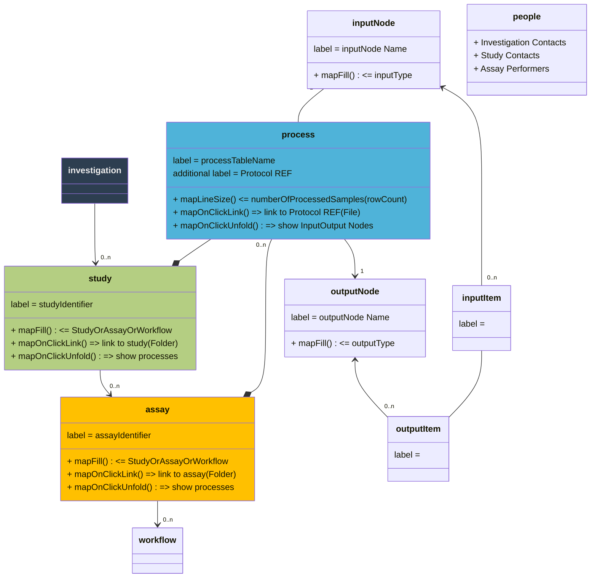

# ARC Process GraphViz

- [Example ARC](#example-arc)
- [Goal](#goal)
  - [Level 1 ("ISA registration" Level)](#level-1-isa-registration-level)
  - [Level 2 ("Process" Level)](#level-2-process-level)
  - [Level 3 ("Sample / data item" Level)](#level-3-sample--data-item-level)
- [Code base](#code-base)
- [Viz ideas](#viz-ideas)
- [Additional / Future](#additional--future)
- [Data ingest](#data-ingest)
- [Node-edge table](#node-edge-table)
- [Assumptions / challenges](#assumptions--challenges)
- [Model notes](#model-notes)
- [Setup (ana)conda for python scripts](#setup-anaconda-for-python-scripts)


## Example ARC

For test purposes

https://git2.nfdi4plants.org/brilator/ARC-Process-GraphViz-Example


## Goal

- Visualize flow of (experimental) samples / processes in an ARC
  - Sample-to-sample-to-data(-to-result)
- List studies and assays of an ARC
  1. Detail 1: Which assay is linked to which study?
  2. Detail 2: Which sample goes through which study (processes) and assay (processes) (to which workflow)
- Interactive (add remove complexity, detail)

### Level 1 ("ISA registration" Level)



### Level 2 ("Process" Level)



### Level 3 ("Sample / data item" Level)



## Code base

1. Read / wrangle ARC metadata model
   1. ARCtrl - read ARC
   2. find overlapping samples between ISA processes
2. Visualize / Graph
   1. Cytoscape, Cy.js
   2. Obsidian
   3. sankey diagram
   4. Plotly / Plotly-Cytoscape

## Viz ideas

- directed acyclic graph
- Nodes = sample / data items
  - edges = processes
- nodes = Study / Assay
  - subnode = StudyProcesses / AssayProcesses
    - subsubnode = Sample
- edge-size
  - map to number of samples
- display contributor info
  - ISA contacts
  - git blame

## Additional / Future

- computational workflows

## Data ingest

1. Read ARC
2. List processes (ignore whether study or assay)
3. List input / output IDs (sample / data items)
4. Find overlapping items
5. Assign process


## Node-edge table

input | process | output
------|---------|-------
sample0 | study1:processA | sample0-A
sample1 | study1:processA | sample1-A
sample2 | study1:processA | sample2-A
sample0-A | study1:processB | sample0-B
sample1-A | study1:processB | sample1-B
sample2-A | study1:processB | sample2-B
sample4 | study2:processC | sample4-C
sample5 | study2:processC | sample5-C
sample6 | study2:processC | sample6-C
sample7 | study2:processC | sample7-C
sample8 | study2:processC | sample8-C
sample9 | study2:processC | sample9-C
sample4-C | study2:processD | sample4-D
sample5-C | study2:processD | sample5-D
sample6-C | study2:processD | sample6-D
sample7 | study2:processE | sample7-E
sample8 | study2:processE | sample8-E
sample9 | study2:processE | sample9-E
sample4-D | assay2:processF | sample4-F
sample5-D | assay2:processF | sample5-F
sample6-D | assay2:processF | sample6-F

## Assumptions / challenges

1. unique IDs
2. relative paths / references across the ARC studies / assays
3. process names
   1. fallback: sheet name of study / assay workbooks
   2. additional detail: Protocol REF


## Model notes

trying to model / keep notes of what to display where




## Setup (ana)conda for python scripts

1. Store as `environment.yml`:

```yml
name: arc-process-graph
channels:
  - defaults
dependencies:
  - pip
  - python=3.12
  - pip:
    - arctrl
    - fsspreadsheet
    - dash
    - dash_cytoscape
```

2. Create conda environment

```bash
conda env create -f environment.yml
```

3. Activate conda environment

```bash
conda activate arc-process-graph
```

4. Deactivate conda environment

```bash
conda deactivate arc-process-graph
```
