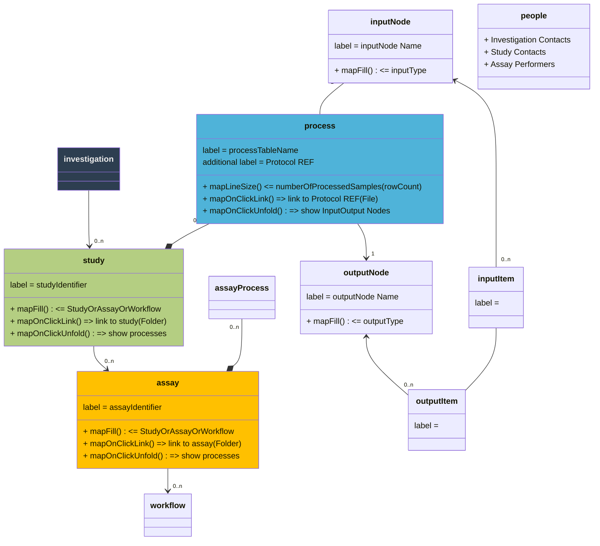

```mermaid

classDiagram
    
direction TD

    investigation --> "0..n" study
    study --> "0..n" assay
    assay --> "0..n" workflow

    process "0..n" --* study
    assayProcess "0..n" --* assay

    inputNode "1" -- process
    process --> "1" outputNode

    inputNode <-- "0..n" inputItem
    outputNode <-- "0..n" outputItem

    inputItem -- outputItem

    class inputItem {
        label = 
    }

    class outputItem {
        label = 
    }

    class study {
        label = studyIdentifier
        + mapFill() <= StudyOrAssayOrWorkflow
        + mapOnClickLink() => link to study (Folder)
        + mapOnClickUnfold() => show processes
    }

    class assay {
        label = assayIdentifier
        + mapFill() <= StudyOrAssayOrWorkflow
        + mapOnClickLink() => link to assay (Folder)
        + mapOnClickUnfold() => show processes
    }

    class process {
        label = processTableName
        additional label = Protocol REF
        + mapLineSize() <= numberOfProcessedSamples (rowCount)
        + mapOnClickLink() => link to Protocol REF (File)
        + mapOnClickUnfold() => show InputOutput Nodes
    }

    class inputNode {
        label = inputNode Name
        + mapFill() <= inputType     
    }

    class outputNode {
        label = outputNode Name
        + mapFill() <= outputType     
    }

    class people{
        + Investigation Contacts
        + Study Contacts
        + Assay Performers
}


style investigation fill: #2D3E50,color:#ECEBEB;
style study fill: #B4CE82
style assay fill: #FFC000
style process fill: #4FB3D9
    

```

