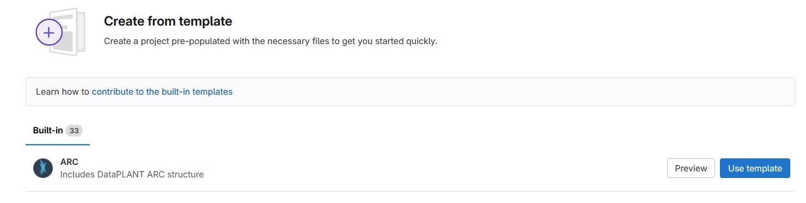

---
authors:
  - name: Sabrina Zander
    orcid: 0009-0000-4569-6126
    affiliation: MibiNet
  - name: Stella Eggels
    orcid: 0000-0001-9436-3109
    affiliation: DataPLANT
---
# Motivation and Solution

Users that want to initiate a project following the ARC structure directly in the DataHUB can use ARC templates. A minimal ARC template provides the basic folder structure with explanations in the readme. We updated the existing ARC template to the current standards and created two examples of experiment type- specific ARC templates, one for Genomics and one for Metabolomics. These additional experiment type - specific ARC templates can provide a starting point for new ARC creators that provide suggestions for suitable studies, assays, and metadata templates in the isa files, as well as a suggestion for a readme structure.

# Technical details

Template ARCs are currently stored in an arc_templates group in the DataHUB: https://git.nfdi4plants.org/arc_templates. We discussed that in the future they should probably be moved to GitHub, where one repository will be needed per ARC template. To not overload the nfdi4plants GitHub organization, an extra arc template organization might be the best solution if there is sufficient usage.
Once the implementation is finalized, when creating a new project in the DataHUB the option "create from template" allows to select from the different ARC templates and initiate an ARC following their structure. All non-DataPLANT templates can be deleted from the DataHUB project templates.

