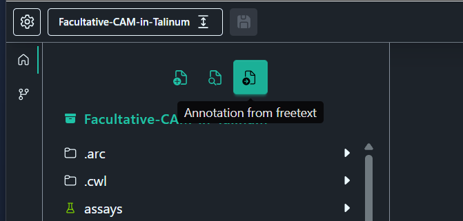

---

title: 'BOAT implementation: Implementing the BOAT tool into the new Swate App'
title_short: 'BOAT implementation'
tags:
  - Annotation
  - metadata
  - ARC
  - tooling
authors:
  - name: Annika Paul
    orcid: https://orcid.org/0009-0008-7417-0965
    affiliation: 1
    role: Development
affiliations:
  - name: Computational Systems Biology, Rheinland-Pfälzische Technische Universität Kaiserslautern-Landau, Kaiserslautern, Germany
    index: 1
date: 2026-07-09

---

# General workload in the ARC Symposium 2026

Setting up the components of [BOAT](https://github.com/nfdi4plants/Swate/tree/feature/BOATAddon) in the Swate playground and adjusting the Swate styling to be integrated into the Electron Swate App.

## BOAT

[BOAT](https://github.com/nfdi4plants/BOAT-Builder-for-Ontology-Annotation-Tables) - Builder for Ontology Annotation Tables is a web-based tool to direct assist in creating metadata annotations out of free text protocols. These can be connected with ontologies and  an MS Excel and ARC compatible output gets created containing the annotations the user created describing a experimental processes. If the user is new or unfamiliar to the environment of DataPLANT tools and ARCs, this tool gives a direct entry into receiving metadata from your experimental processes, which are crucial for an ARC and to take advantage of the opportunities. The metadata can be connected with ontologies and an MS Excel and ARC compatible output containing your metadata can be downloaded as XLSX or JSON. A more detaield documenation of BOAT can be found on the nfdi4plants [knowledgebase](https://nfdi4plants.github.io/nfdi4plants.knowledgebase/resources/boat/) or under the "Help" tab directly in [BOAT](https://nfdi4plants.github.io/BOAT-Builder-for-Ontology-Annotation-Tables/#/Help).

## Integration of BOAT into Swate

As a main project of the ARC-Symposium 2026, the elements of [BOAT](https://github.com/nfdi4plants/BOAT-Builder-for-Ontology-Annotation-Tables) tool, which are already part of the DataPLANT environment, got turned into usable components for the Electron [Swate App](https://github.com/nfdi4plants/Swate/tree/epic/SwateApp). They're not integrated into the Swate app yet, due to time constraints by working on side projects such as Contigo and Swate app, but they can be used in the playground inside the components and will be integrated into the Swate App as the next step. [This folder](https://github.com/Rookabu/Integrate-BOAT-into-Swate-environment/tree/BOAT-Integration/BOAT-integration-into-Swate/BOAT) contains all the new files created inside the the [Components](https://github.com/nfdi4plants/Swate/tree/feature/BOATAddon/src/Components/src/Page/BOAT) of Swate. A copy of them can be find in "alterned BOAT Components"

## Motivation

With the growing scope of existing tool in the dataPLANT environment, having every tool seperated from each other can result in a higher workload for the user, since they have to switch apps and have to search which tool is needed for a specific task. With the ARCitect, user were able to work on ARCS and alternate Table using Swate and with new component [Contigo](https://github.com/nfdi4plants/ARC-Symposium/tree/main/Contigo) , user can handle the provenance of their tables directly in the new Swate app. To complete the picture, the next step is to integrate BOAT as a usbale component directly inside the Swate app. With that, user can annotate new processes directly out of their free text protocol and append their tables with it, with no need of leaving the Swate app.

## Concept

The main idea is to create a button inside the left sidebar with a self-explanatory icon.

The button opens BOAT on the right side, which is the main view side.

Upload, annotation inside the free text protocol, the contextmenu aswell as adding ontologies works the same way as they do in the standalone web app. The download however, will be replaced with a logic which enables the user to add the annotated process as a table to an existing folder inside their ARC in which they are working on currently in the Swate app. 

## Implementation

The implementation is not finished yet but can be tracked on the [feature/BOATAddon branch](https://github.com/nfdi4plants/Swate/tree/feature/BOATAddon) of Swate. 

