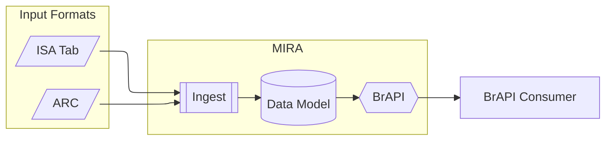

# MIAPPE compliant ARCs as BrAPI Servers

Goal of this project is to extend MIRA to support ARC/RO-Crate as input format. MIRA takes a MIAPPE compliant ISArchive as input and, using the mapping between ISA, MIAPPE and BrAPI, deploys automatically a BrAPI Server for the relevant BrAPI endpoints.

To achieve this, MIRA is redesigned to have an ingestion process for each input format. The BrAPI endpoints will then be implemented on top of the internal database.

## Goals for the ARC Symposium

[x] Create a `ro-crate.json` from an ARC \
[x] Ingest the `ro-crate.json` in an ETL process to an internal data model based on BrAPI ER schema \
[x] Implement examplary endpoint on this data model

## Results

The `ro_crate.json` was created for an exemplary ARC dataset (https://git.nfdi4plants/feser/test-dataset). Currently, the ETL process is being implemented to ingest the investigation object, which corresponds to the Trial entity in BrAPI. To showcase a proof of concept, `GET /trials` and `GET /trials/{trialDbId}` have been implemented. The next steps will complete the ingestion and implementation of the remaining BrAPI endpoints. As the switch to preprocessing through an ETL process required a reimplementation of MIRA, ISA Tab support will be added later.

## References 

- [Website](https://mira.ipk-gatersleben.de)
- [Demonstrator](https://mira.ipk-gatersleben.de/bridge)
- [Documentation](https://mira-server.rtfd.io/)
- [Github Repository](https://github.com/IPK-BIT/mira)