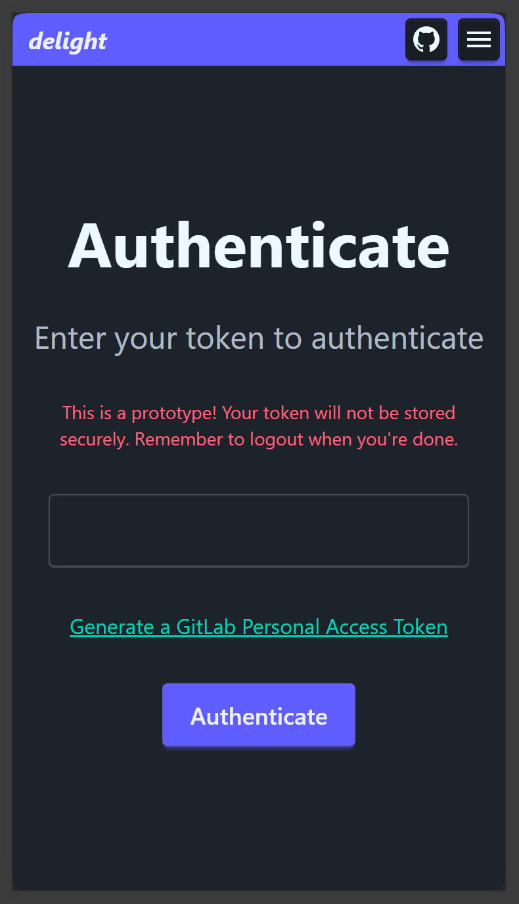
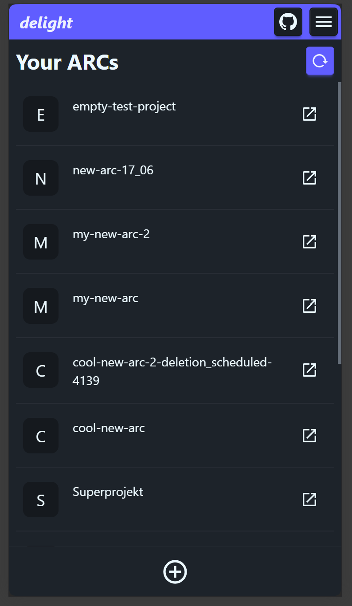
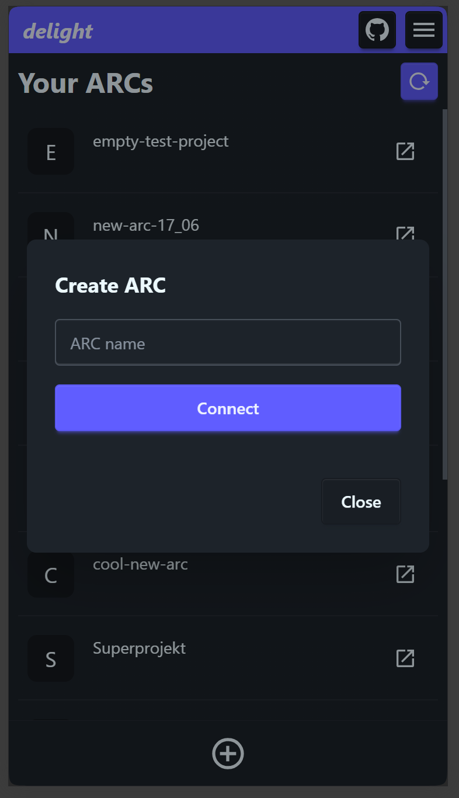
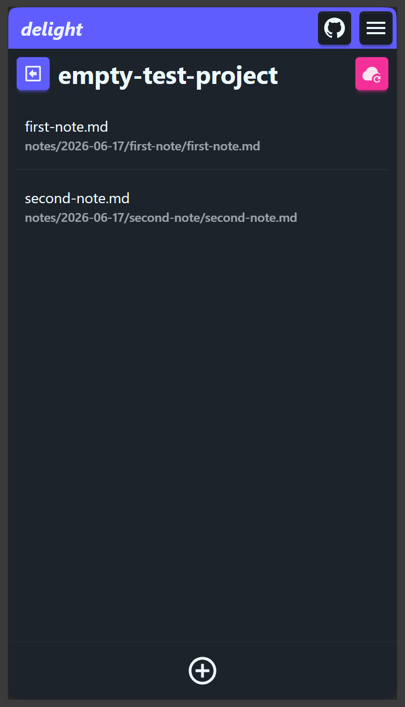
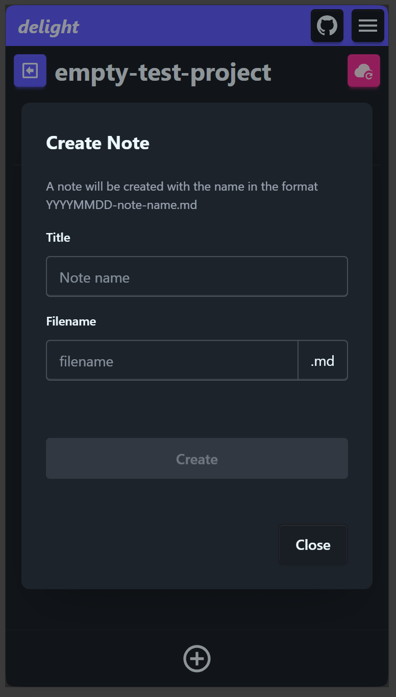
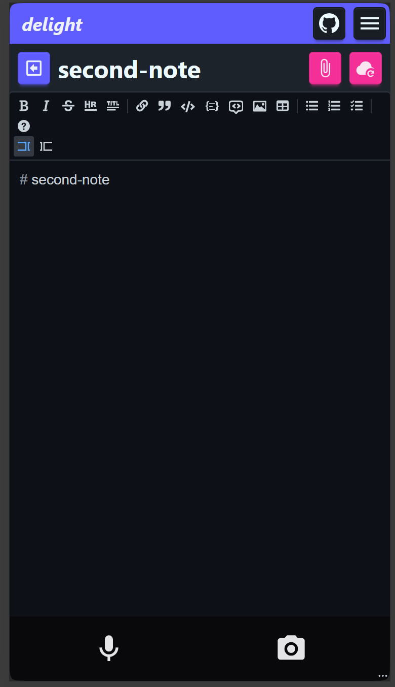
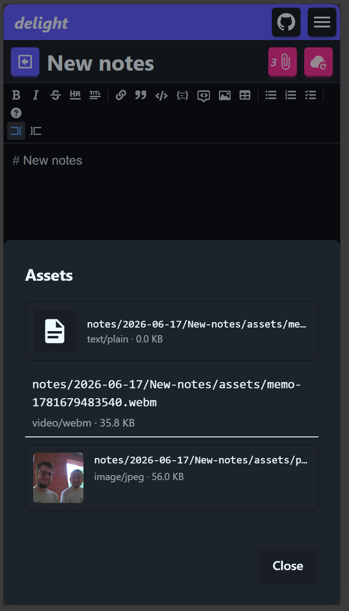
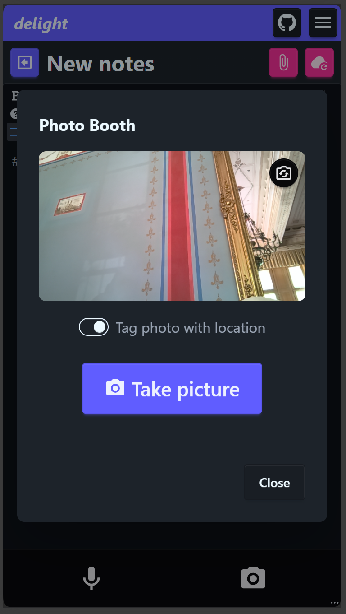
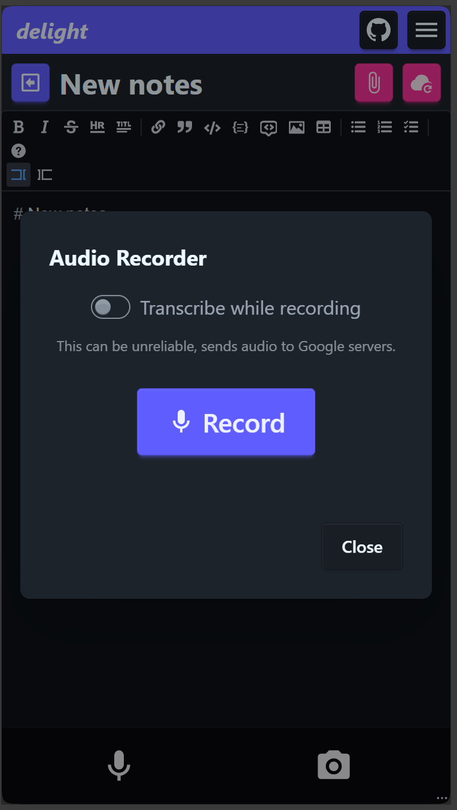

---

## Goal

Create a low-level access to the ARC ecosystem. Allowing users to take notes, images, recordings and upload them quickly to an ARC. Mobile first approach.

## Proposed solution

Develop a progressive web app:
- No stores required, "installation" optional
- Can be used offline
- Accessible from all browsers (some features limited by browser)

Communicate with DataHUB via GitLab api, to avoid need for `.git`. 

Use technologies similiar to Swate to allow usage of a combined code base (Swate.Components) to share features and avoid duplicating work load.

Notes structure minimal as follows:

```
notes/
|--yyyy-mm-dd/
   |--title/
      |--assets/
      |--title.md
```

### Planned feature set for Demo

See issue: https://github.com/nfdi4plants/Delight/issues/1

- [x] authenticate with datahub via token
- [x] git service/gitlab api 
  - validate with token
  - pull notes generic (path + name)
  - pull specific note full (markdown + assets)
  - sync changes
  - new repo
  - list repos
- [x] Caches local changes into indexedDB
- [x] Repo browser
  - [x] Open Repo notes 
  - [x] Create Repo
- [x] notes browser
  - [x] select note to actively edit
  - [x] create new note
- [x] top navbar, burger menu with drawer left/right 
  - logout button
  - Sync button
- [x] Note editor 
- [x] voice memo (dock btn)
- [x] speech to text (dock btn)

<details>
<summary>Views</summary>

1. "Login" View

- input field for token
- submit button which validates token and stores in state

2. Arc Browser

- List repos, click on repo conntects in main view
- dock with create new repo with `notes/` folder

3. Notes Browser

- notes list, click opens editor
- create new button, fixed, scrolls
- dock with create note (future, search button)

4. Note Editor

- editor main view
- dock with take picture

</details>

## Implementation

- GitHub Repo: https://github.com/nfdi4plants/Delight
- GitHub Pages: https://nfdi4plants.github.io/Delight/

### Technologies used

- Based on Vite PWA template:
  - https://vite-pwa-org.netlify.app/guide/ 
  - `npm create @vite-pwa/pwa@1.1.0`
- Web framework: React v19 (https://react.dev)
- Styling: https://daisyui.com/
- Icons: 
  - https://icon-sets.iconify.design/mdi/
  - tailwind plugin
- MarkdownEditor: https://uiwjs.github.io/react-md-editor/

### Preview

#### Login



#### ARC Browser



---



#### Notes Browser



---



#### Note Editor



---



---



---

