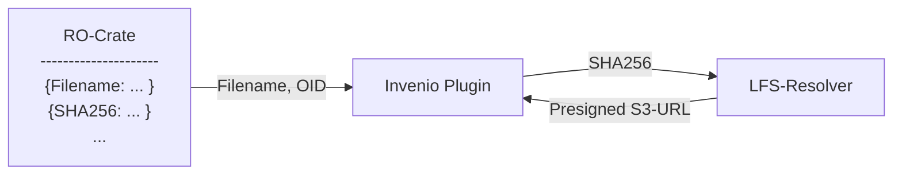

## Initial problem: 
Issue of consistency of ARCs published in Invenio. There was a case of a user setting the ARC back to private after publishing which made the data unaccessible from the Publication page

## Solution approach

- In theory, the publication represents a snapshop of the ARC
- RO-Crate contains all necessary metadata, can act as a full snapshot
- LFS Data blobs are present but not accessible without a link 
    - If all information necessary to retrieve the LFS files is in the RO-Crate we wouldn't need more

## Technical requirements

### Invenio

Invenio view plugin which has previews the RO-Crate metadata as a file tree and resolves the file references to storage

### ARCitect

ARCitect makes sure that all files referenced in the metadata are tracked by git LFS

### Representation in RO-Crate

FIles annotated in the RO-Crate MUST contain all information necessary to identify the LFS 

https://schema.org/MediaObject contains property `sha256`

# Solution Sketch

