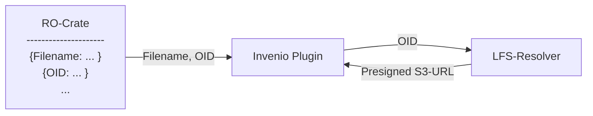

```mermaid
graph LR
    RO_Crate["RO-Crate
    ---------------------
    {Filename: ... }
    {OID: ... }
    ..."]
    Invenio["Invenio Plugin"]
    LFS["LFS-Resolver"]

    RO_Crate -->|Filename, OID| Invenio
    Invenio -->|OID| LFS
    LFS -->|Presigned S3-URL| Invenio
```
