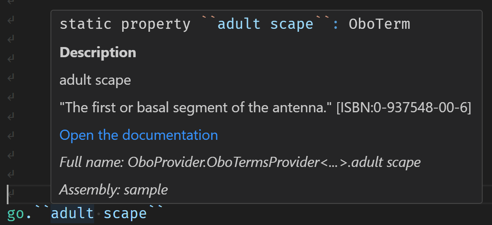
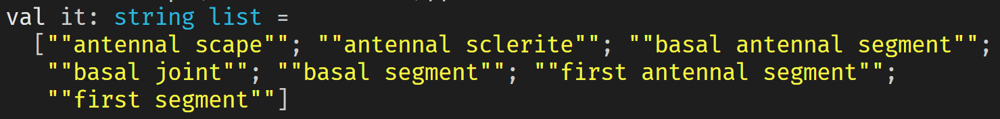

# Summary

This project developed an F# Type Provider for ontologies, aiming to improve the integration of ontology terms into ARC validation workflows.
Instead of parsing ontology files at runtime and navigating lists of terms programmatically, the type provider exposes ontology terms as named static properties, enabling enhanced tooling support such as autocomplete, static type checking, and code navigation in development environments.

# Introduction

In the context of validation packages for ARCs (Annotated Research Context), ontologies are essential for validating structural and semantic metadata.
Existing approaches based on parsing (e.g. OBO files) provide the required data but lack strong IDE support.
Type providers are a feature of the F# programming language that allows developers to generate types at compile time based on external data sources.
An OBO type provider would offer a declarative and discoverable way to reference ontology terms in code, reducing errors and improving developer experience.

# Results

Type providers for all `[Term]` and `[Typedef]` stanzas in OBO files were implemented, allowing developers to access them as strongly typed properties.
An example can seen in the `sample.fsx` file, where ontology terms from `some_go_terms.obo` (a small subset from the go ontology) are accessed using the type provider.
The type provider generates types for each term, enabling static type checking and autocompletion in IDEs.
An example can be seen in this screenshot, where the generated type for the following obo term is shown:

```obo
[Term]
id: TGMA:0000010
name: adult scape
def: "The first or basal segment of the antenna." [ISBN:0-937548-00-6]
comment: Fig 02,05,06,07,08 Abbr: Sc in ISBN:0-937548-00-6.
synonym: "antennal scape" RELATED [ISBN:0-937548-00-6]
synonym: "antennal sclerite" RELATED [ISBN:0-937548-00-6]
synonym: "basal antennal segment" RELATED [ISBN:0-937548-00-6]
synonym: "basal joint" RELATED [ISBN:0-937548-00-6]
synonym: "basal segment" RELATED [ISBN:0-937548-00-6]
synonym: "first antennal segment" RELATED [ISBN:0-937548-00-6]
synonym: "first segment" RELATED [ISBN:0-937548-00-6]
is_a: TGMA:0001835 ! compound organ component
relationship: part_of TGMA:0000007 ! adult antenna
```

Here is a screenshot of the generated type in an IDE, showing the generated tooltip for this term



And here is what the synonym accession can look like in an IDE, showing the synonym text available for the term

```fsharp
go.``adult scape``.Synonyms
|> List.map (fun x -> x.Text)
```

