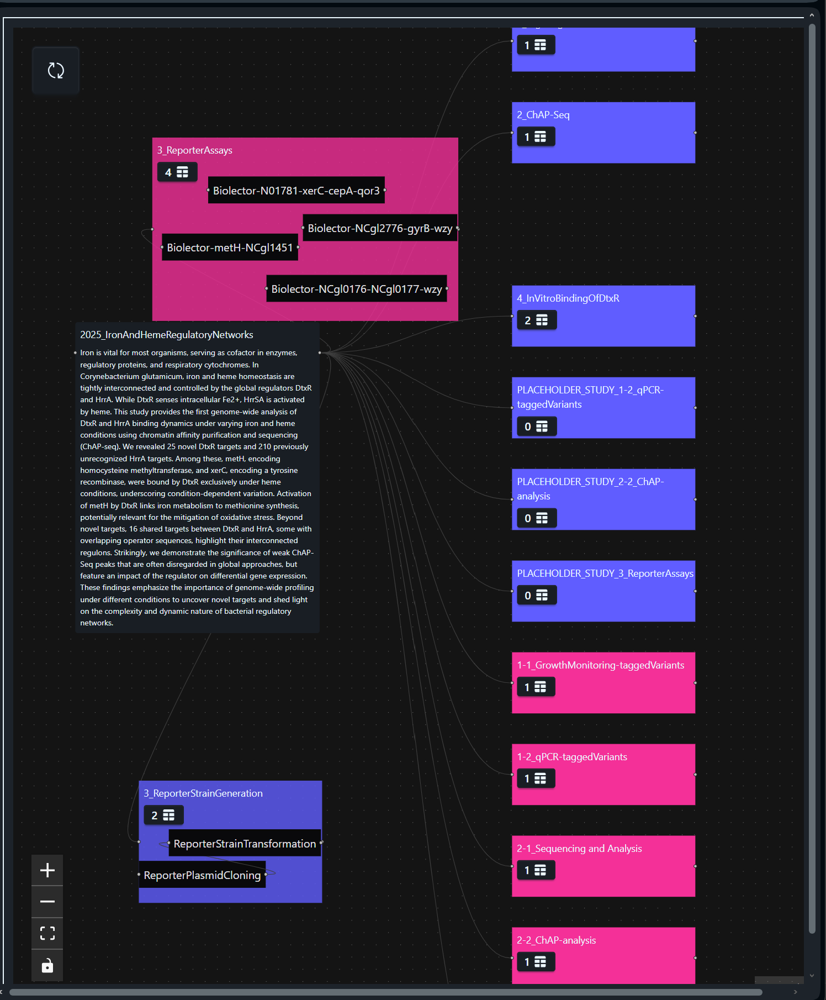

---
authors:
  - name: Kevin Frey
    orcid: https://orcid.org/0000-0002-8510-6810
    affiliation: 1
affiliations:
  - name: Computational Systems Biology, Rheinland-Pfälzische Technische Universität Kaiserslautern-Landau, Kaiserslautern, Germany
    index: 1
---

# Swate Graph View 

## Motivation or Explanation of the Problem

- ARCs are only viewable on file base
- No interactive views on the full ARC
- An alternative to the table-based editing approach could be beneficial for users.

## Proposed Solution with Discussion of constraints

Create an interactive graph that display connections between ARC files and allows deeper investigation

- Must be able to handle changing data states
- Must support user input events
- Must be highly customizable
- MAY use same technologies as Swate to improve connection in ecosystem



## Technical Details on Implementation

### Technologies used:

- F#/Fable
- React
- React Flow (Graphing library)

### Implementations

The below code examples are very rough and do not follow DRY principles.

#### F# bindings for ReactFlow

<details>
<summary>code</summary>

```fsharp

open Feliz
open Fable.Core
open Fable.Core.JsInterop

[<Erase; AutoOpen>]
module console =
    let inline log (msg: obj) = Browser.Dom.console.log(msg)


module ReactFlow =

    importSideEffects "@xyflow/react/dist/style.css"

    [<Literal>]
    let LibName = "@xyflow/react"


type XYPosition = {|x: int; y: int|}

[<StringEnum(CaseRules.LowerFirst)>]
type Position =
    | Left
    | Right
    | Top
    | Bottom

[<StringEnum(CaseRules.LowerFirst)>]
type Parent = | Parent 

type NodeOrigin = (float * float)

type CoordinateExtent = (int * int) * (int * int)

[<StringEnum(CaseRules.LowerFirst)>]
type HandleType =
    | Source
    | Target

[<AllowNullLiteral; Global>]
type NodeHandle
    [<ParamObjectAttribute; Emit("$0")>] (
        x: int,
        y: int,
        position: Position,
        ``type``: HandleType,
        ?width: int,
        ?height: int,
        ?id: string
    ) =
    member val x = x
    member val y = y
    member val position = position
    member val ``type`` = ``type``
    member val width = width
    member val height = height
    member val id = id

[<Erase>]
type NodeType =
    | Custom of string
    
    static member inline Default = Custom "default"
    static member inline Input = Custom "input"
    static member inline Output = Custom "output"
    static member inline Group = Custom "group"

[<AllowNullLiteral; Global>]
type Node
    [<ParamObjectAttribute; Emit("$0")>] (
        id: string,
        position: XYPosition,
        data: obj,
        ?sourcePosition: Position,
        ?targetPosition: Position,
        ?hidden: bool,
        ?selected: bool,
        ?dragging: bool,
        ?draggable: bool,
        ?selectable: bool,
        ?connectable: bool,
        ?deletable: bool,
        // A class name that can be applied to elements inside the
        // node that allows those elements to act as drag handles, 
        // letting the user drag the node by clicking and dragging 
        // on those elements.
        ?dragHandle: string,
        ?width: int,
        ?height: int,
        ?initialWidth: int,
        ?initialHeight: int,
        ?parentId: string,
        ?zIndex: int,
        ?extent: U2<CoordinateExtent, Parent>,
        // When true, the parent node will automatically expand if this node 
        // is dragged to the edge of the parent node’s bounds.
        ?expandParent: bool,
        ?ariaLabel: string,
        ?origin: NodeOrigin,
        ?handles: ResizeArray<NodeHandle>,
        ?measured: {|width: int option; height: int option|},
        ?``type``: NodeType,
        ?style: obj,
        ?className: string,
        ?resizing: bool,
        ?focusable: bool,
        ?ariaRole: string,
        ?domAttributes
    ) =
    member val id = id with get, set
    member val position = position with get, set
    member val data: obj = data with get, set
    member val sourcePosition = sourcePosition with get, set
    member val targetPosition = targetPosition with get, set
    member val hidden = hidden with get, set
    member val selected = selected with get, set
    member val dragging = dragging with get, set
    member val draggable = draggable with get, set
    member val selectable = selectable with get, set
    member val connectable = connectable with get, set
    member val deletable = deletable with get, set
    member val dragHandle = dragHandle with get, set
    member val width = width with get, set
    member val height = height with get, set
    member val initialWidth = initialWidth with get, set
    member val initialHeight = initialHeight with get, set
    member val parentId = parentId with get, set
    member val zIndex = zIndex with get, set
    member val extent = extent with get, set
    member val expandParent = expandParent with get, set
    member val ariaLabel = ariaLabel with get, set
    member val origin = origin with get, set
    member val handles = handles with get, set
    member val measured = measured with get, set
    member val ``type`` = ``type`` with get, set
    member val style = style with get, set
    member val className = className with get, set
    member val resizing = resizing with get, set
    member val focusable = focusable with get, set
    member val ariaRole = ariaRole with get, set
    member val domAttributes = domAttributes with get, set

    [<Emit("{ ...$0 }")>]
    member this.Copy() : Node = jsNative


[<Erase>]
type EdgeType =
    | Custom of string
    static member inline Default = Custom "default"
    static member inline Straight = Custom "straight"
    static member inline Step = Custom "step"
    static member inline SmoothStep = Custom "smoothstep"
    static member inline SimpleBezier = Custom "simplebezier"

[<StringEnum>]
type MarkerType =
    | [<CompiledName("arrow")>] Arrow
    | [<CompiledName("arrowclosed")>] ArrowClosed

[<AllowNullLiteral; Global>]
type EdgeMarker
    [<ParamObjectAttribute; Emit("$0")>] (
        ``type``: MarkerType,
        ?color: string,
        ?width: int,
        ?height: int,
        ?markerUnits: string,
        ?orient: string,
        ?strokeWidth: int
    ) =
    member val ``type`` = ``type``
    member val color = color
    member val width = width
    member val height = height
    member val markerUnits = markerUnits
    member val orient = orient
    member val strokeWidth = strokeWidth


[<AllowNullLiteral; Global>]
type Edge 
    [<ParamObjectAttribute; Emit("$0")>] (
        id: string,
        source: string,
        target: string,
        ?``type``: EdgeType,
        ?sourceHandle: string,
        ?targetHandle: string,
        ?animated: bool,
        ?hidden: bool,
        ?deletable: bool,
        ?selectable: bool,
        ?data: obj,
        ?selected: bool,
        ?markerStart: EdgeMarker,
        ?markerEnd: EdgeMarker,
        ?zIndex: int,
        ?ariaLabel: string,
        // ReactFlow renders an invisible path around each edge to make them easier to click or tap on. 
        // This property sets the width of that invisible path.
        ?interactionWidth: int,
        ?label: ReactElement,
        ?labelStyle: obj,
        ?labelShowBg: bool,
        ?labelBgStyle: obj,
        ?labelBgPadding: int * int,
        ?labelBgBorderRadius: int,
        ?style: obj,
        ?className: string,
        ?reconnectable: U2<bool, HandleType>,
        ?focusable: bool,
        ?ariaRole: string,
        ?domAttributes
    ) =
    member val id = id
    member val source = source
    member val target = target
    member val ``type`` = ``type``
    member val sourceHandle = sourceHandle
    member val targetHandle = targetHandle
    member val animated = animated
    member val hidden = hidden
    member val deletable = deletable
    member val selectable = selectable
    member val data = data
    member val selected = selected
    member val markerStart = markerStart
    member val markerEnd = markerEnd
    member val zIndex = zIndex
    member val ariaLabel = ariaLabel
    member val interactionWidth = interactionWidth
    member val label = label
    member val labelStyle = labelStyle
    member val labelShowBg = labelShowBg
    member val labelBgStyle = labelBgStyle
    member val labelBgPadding = labelBgPadding
    member val labelBgBorderRadius = labelBgBorderRadius
    member val style = style
    member val className = className
    member val reconnectable = reconnectable
    member val focusable = focusable
    member val ariaRole = ariaRole
    member val domAttributes = domAttributes

[<Global>]
type ReactFlowInstance =

    member this.getNodes() : ResizeArray<Node> = jsNative
    member this.getEdges() : ResizeArray<Edge> = jsNative
    member this.setNodes (nodes: ResizeArray<Node>) : unit = jsNative
    member this.setNodes (nodes: ResizeArray<Node> -> ResizeArray<Node>) : unit = jsNative
    member this.setEdges (edges: ResizeArray<Edge>) : unit = jsNative
    member this.setEdges (edges: ResizeArray<Edge> -> ResizeArray<Edge>) : unit = jsNative
    member this.fitView(options: obj) : unit = jsNative

[<StringEnum(CaseRules.KebabCase)>]
type PanelPosition =
    | TopLeft
    | TopCenter
    | TopRight
    | BottomLeft
    | BottomCenter
    | BottomRight

[<Erase; Mangle(false)>]
type ReactFlow =

    [<ImportMember(ReactFlow.LibName)>]
    static member applyEdgeChanges(changes: obj, edges: ResizeArray<Edge>) = jsNative

    [<ImportMember(ReactFlow.LibName)>]
    static member applyNodeChanges(changes: obj, nodes: ResizeArray<Node>) = jsNative

    [<ImportMember(ReactFlow.LibName)>]
    static member addEdge(parameter: obj, edges: ResizeArray<Edge>) = jsNative
    
    [<ImportMember(ReactFlow.LibName)>]
    static member isEdge(obj: obj) : bool = jsNative

    [<ImportMember(ReactFlow.LibName)>]
    static member isNode(obj: obj) : bool = jsNative

    [<ReactComponent("ReactFlow", ReactFlow.LibName)>]
    static member ReactFlow(
        children: #seq<ReactElement>, 
        ?nodes: ResizeArray<Node>, 
        ?edges: ResizeArray<Edge>,
        ?nodeTypes: obj,
        ?onNodesChange: (obj -> unit), 
        ?onEdgesChange: (obj -> unit), 
        ?onConnect: (obj -> unit), 
        ?colorMode: string,
        ?onInit: obj -> unit) = React.imported()

    [<ReactComponent("Background", ReactFlow.LibName)>]
    static member Background(?key: string) = React.imported()

    [<ReactComponentAttribute("Controls", ReactFlow.LibName)>]
    static member Controls(?key: string) = React.imported()

    [<ReactComponent("Handle", ReactFlow.LibName)>]
    static member Handle(
        position: Position, 
        ``type``: HandleType, 
        ?id: string, 
        ?isConnectable: bool,
        ?isConnectableStart: bool,
        ?isConnectableEnd: bool,
        ?isValidConnection: obj,
        ?onConnect: obj -> unit,
        ?props: obj) = React.imported()

    [<ReactComponent("Panel", ReactFlow.LibName)>]
    static member Panel(position: PanelPosition, ?key: string, ?children: #seq<ReactElement>) = React.imported()

    [<ReactComponent("MiniMap", ReactFlow.LibName)>]
    [<ImportMember(ReactFlow.LibName)>]
    static member useReactFlow() : ReactFlowInstance = jsNative

open ARCtrl

[<AutoOpen>] 
module FableResizeArrayExtensions =

    module ResizeArray =
    
        [<Emit("$1.map($0)")>]
        let inline map (f: 'T -> 'U) (arr: ResizeArray<'T>) : ResizeArray<'U> = jsNative

        [<Emit("$1.filter($0)")>]
        let inline filter (f: 'T -> bool) (arr: ResizeArray<'T>) : ResizeArray<'T> = jsNative


module DagreJs =

    // const getLayoutedElements = (nodes, edges, options) => {
    //     const g = new Dagre.graphlib.Graph().setDefaultEdgeLabel(() => ({}));
    //     g.setGraph({ rankdir: options.direction });
        
    //     edges.forEach((edge) => g.setEdge(edge.source, edge.target));
    //     nodes.forEach((node) =>
    //         g.setNode(node.id, {
    //         ...node,
    //         width: node.measured?.width ?? 0,
    //         height: node.measured?.height ?? 0,
    //         }),
    //     );
        
    //     Dagre.layout(g);
        
    //     return {
    //         nodes: nodes.map((node) => {
    //         const position = g.node(node.id);
    //         // We are shifting the dagre node position (anchor=center center) to the top left
    //         // so it matches the React Flow node anchor point (top left).
    //         const x = position.x - (node.measured?.width ?? 0) / 2;
    //         const y = position.y - (node.measured?.height ?? 0) / 2;
        
    //         return { ...node, position: { x, y } };
    //         }),
    //         edges,
    //     };
    //     };

    let getLayoutedElements (nodes: ResizeArray<Node>, edges: ResizeArray<Edge>) =
        console.log ("layouting")
        let g = 
            emitJsExpr
                ()
                """import Dagre from '@dagrejs/dagre';
new Dagre.graphlib.Graph().setDefaultEdgeLabel(() => ({}))"""
        g?setGraph({| rankdir = "LR" |}) 

        for edge in edges do
            g?setEdge(edge.source, edge.target)
        for node in nodes do
            let width = 
                node.width |> Option.defaultValue 100
            let height = node.height |> Option.defaultValue 100
            let nodeObj = createObj [
                "id" ==> node.id
                "width" ==> width
                "height" ==> height
            ]
            g?setNode(node.id, nodeObj) |> ignore
        
        emitJsExpr
            ()
            """Dagre.layout(g)"""
        |> ignore

        {|
            nodes = nodes |> ResizeArray.map(fun node ->
                let position = g?node(node.id)
                // We are shifting the dagre node position (anchor=center center) to the top left
                // so it matches the React Flow node anchor point (top left).
                let x = position?x - (node.width  |> Option.defaultValue 0) / 2
                let y = position?y - (node.height |> Option.defaultValue 0) / 2

                let newPosition = {| x = x; y = y |}
                console.log(newPosition)
                Fable.Core.JS.Constructors.Object.assign(node, {| position = newPosition |})
                |> unbox<Node>
            )
            edges = edges
        |}

```

</details>

#### Utility functions to parse ARC Objects into target node-edge structure

<details>
<summary>code</summary>

```fsharp


type private AssayNodeData =
    {|
        assay: ArcAssay
        label: string
        isContainer: bool
    |}

type private StudyNodeData =
    {|
        study: ArcStudy
        label: string
        isContainer: bool
    |}

type private InvestigationNodeData =
    {|
        investigation: ArcInvestigation
        label: string
    |}

type private TableNodeData =
    {|
        table: ArcTable
        id: string
        label: string
    |}

[<AutoOpen>]
module ARCtrlReactFlowExtensions =

    [<Literal>]
    let __DEFAULT_NODE_WIDTH__ = 300

    [<Literal>]
    let __DEFAULT_NODE_HEIGHT__ = 100

    let mkInvestigationNode (inv: ArcInvestigation) =
        let data: InvestigationNodeData = 
            {| investigation = inv; label = inv.Title |> Option.defaultValue "" |}
        Node(
            id = inv.Identifier,
            position = {| x = 0; y = 0 |},
            ``type`` = NodeType.Custom "investigation",
            className = "transition-[width,height] duration-300 ease-in-out",
            targetPosition = Position.Left,
            sourcePosition = Position.Right,
            data = data,
            width = __DEFAULT_NODE_WIDTH__ + 100,
            height = __DEFAULT_NODE_HEIGHT__
        )

    let mkStudyNode (study: ArcStudy) =
        let data: StudyNodeData =
            {| study = study; label = study.Title |> Option.defaultValue ""; isContainer = false |}
        Node(
            study.Identifier,
            position = {| x = 0; y = 0 |},
            ``type`` = NodeType.Custom "study",
            className = "transition-[height,width] duration-300 ease-in-out",
            targetPosition = Position.Left,
            sourcePosition = Position.Right,
            data = data,
            width = __DEFAULT_NODE_WIDTH__,
            height = __DEFAULT_NODE_HEIGHT__
        )

    let mkAssayNode (assay: ArcAssay) =
        let data: AssayNodeData =
            {| assay = assay; label = assay.Identifier; isContainer = false |}
        Node(
            assay.Identifier,
            ``type`` = NodeType.Custom "assay",
            position = {| x = 0; y = 0 |},
            className = "transition-[height,width] duration-300 ease-in-out",
            targetPosition = Position.Left,
            sourcePosition = Position.Right,
            data = data,
            width = __DEFAULT_NODE_WIDTH__,
            height = __DEFAULT_NODE_HEIGHT__
        )

    let mkTableNode (table: ArcTable) (parentId: string option) =
        let id = 
            match parentId with
            | Some pid -> $"{pid}_{table.Name}"
            | None -> table.Name

        let data: TableNodeData =
            {| table = table; label = table.Name; id = id |}
        Node(
            id = id,
            position = {| x = 0; y = 0 |},
            ``type`` = NodeType.Custom "table",
            className = "transition-[height,width] duration-300 ease-in-out",
            targetPosition = Position.Left,
            sourcePosition = Position.Right,
            data = data,
            ?parentId = parentId,
            ?extent = (if parentId.IsSome then U2.Case2 Parent.Parent |> Some else None)
        )

    type ArcInvestigation with
        member this.ToReactFlow() : (ResizeArray<Node> * ResizeArray<Edge>) =
            let nodes = ResizeArray<Node>()
            let edges = ResizeArray<Edge>()

            let invNode =
                mkInvestigationNode this

            let studyNodes =
                this.Studies
                |> Seq.map (fun study ->
                    mkStudyNode study
                )

            let assayNodes =
                this.Assays
                |> Seq.map (fun assay ->
                    mkAssayNode assay
                )

            // create and add edges
            for studyNode in studyNodes do
                edges.Add(Edge(
                    id = $"{invNode.id}-{studyNode.id}",
                    source = invNode.id,
                    target = studyNode.id
                ))

            for assayNode in assayNodes do
                edges.Add(Edge(
                    id = $"{invNode.id}-{assayNode.id}",
                    source = invNode.id,
                    target = assayNode.id
                ))

            // add nodes 
            nodes.Add(invNode)
            nodes.AddRange(studyNodes)
            nodes.AddRange(assayNodes)

            nodes, edges

module ReactFlowARCtrlHelper =

    let dumpOrphanEdges (node: ResizeArray<Node>) (edges: ResizeArray<Edge>) : ResizeArray<Edge> =
        let nodeIds = node |> ResizeArray.map (fun n -> n.id) |> Set.ofSeq
        edges
        |> ResizeArray.filter (fun edge ->
            nodeIds.Contains edge.source && nodeIds.Contains edge.target
        )

    let mkTablesEdges(tableNodes: ResizeArray<Node>) (edges: ResizeArray<Edge>) : ResizeArray<Edge> =
        let edges = ResizeArray<Edge>(edges)
        let tableNodes = tableNodes |> ResizeArray.filter (fun node -> node.``type`` = Some (NodeType.Custom "table")) 
        let tables = tableNodes |> ResizeArray.map (fun node -> node.data |> unbox<TableNodeData> |> fun d -> d.id, d.table)
        // let inputCollection = 
        //     tables
        //     |> Seq.collect (fun (id, table) ->
        //         table.GetInputColumn().Cells |> Array.map (fun cell -> cell.ToString()) |> Array.distinct |> Array.map (fun cell -> cell, id)
        //     )
        //     |> Seq.groupBy fst
        //     |> Seq.map (fun (id, cells) -> id, cells |> Seq.map snd |> Seq.toArray)
        //     |> Map
        //     |> System.Collections.Generic.Dictionary
        // Create collection of key: input to string value; value: array of tableNodeIds
        let outputCollection = 
            tables
            |> Seq.collect (fun (id, table) ->
                table.GetOutputColumn().Cells |> Array.map (fun cell -> cell.ToString()) |> Array.distinct |> Array.map (fun cell -> cell, id)
            )
            |> Seq.groupBy fst
            |> Seq.map (fun (id, cells) -> id, cells |> Seq.map snd |> Seq.toArray)
            |> Map
            |> System.Collections.Generic.Dictionary
        let addedCollection = System.Collections.Generic.Dictionary<string, bool>()
        for tableNode in tableNodes do
            let tableData = tableNode.data |> unbox<TableNodeData>
            let sourceId = tableData.id
            let inputs = tableData.table.GetInputColumn().Cells |> Array.map (fun cell -> cell.ToString()) |> Array.distinct
            // let outputs = tableData.table.GetOutputColumn().Cells |> Array.map (fun cell -> cell.ToString()) |> Array.distinct
            for input in inputs do
                if outputCollection.ContainsKey input then
                    let tableNodeIds = outputCollection.[input]
                    for tableNodeId in tableNodeIds do
                        let id = $"{tableNodeId}-{sourceId}"
                        if tableNodeId <> sourceId && not (addedCollection.ContainsKey id) then
                            addedCollection.Add(id, true)
                            let newEdge = Edge(
                                id = id,
                                source = tableNodeId,
                                target = sourceId,
                                ``type`` = EdgeType.Default,
                                zIndex = 1
                            )
                            edges.Add(newEdge)
            // for output in outputs do
            //     if inputCollection.ContainsKey output then
            //         let tableNodeIds = inputCollection.[output]
            //         for tableNodeId in tableNodeIds do
            //             if tableNodeId <> sourceId then
            //                 let newEdge = Edge(
            //                     id = $"{sourceId}-{tableNodeId}",
            //                     source = sourceId,
            //                     target = tableNodeId,
            //                     ``type`` = EdgeType.Default
            //                 )
            //                 edges.Add(newEdge)
        edges
            
    let expandAssayNode (id: string) (nodes: ResizeArray<Node>) (edges: ResizeArray<Edge>) =
        let mutable assayRef : Node option = None
        let updatedNodes =
            nodes 
            |> ResizeArray.map (fun node ->
                if node.id = id then
                    assayRef <- Some node
                    let newData = node.data |> unbox<AssayNodeData> |> fun d ->
                        {| d with isContainer = true |}
                    // let tableCount = newData.assay.TableCount
                    let copy = node.Copy()
                    copy.data <- box newData
                    if newData.assay.Tables.Count > 0 then
                        copy.width <- Some (newData.assay.Tables.Count * 100 + 100)
                        copy.height <- Some (newData.assay.Tables.Count * 50 + 100)
                    copy
                else
                    node
            )
        let tableNodes =
            if assayRef.IsSome then
                let assay = assayRef.Value.data |> unbox<AssayNodeData>
                assay.assay.Tables
                |> ResizeArray.map (fun table ->
                    mkTableNode table (Some assayRef.Value.id)
                )
            else
                ResizeArray<Node>()
        updatedNodes.AddRange(tableNodes)
        let updatedEdges = mkTablesEdges updatedNodes edges
        {|nodes = updatedNodes; edges = updatedEdges|}

    let expandStudyNode (id: string) (nodes: ResizeArray<Node>) (edges: ResizeArray<Edge>) =
        let mutable studyRef : Node option = None
        let updatedNodes =
            nodes 
            |> ResizeArray.map (fun node ->
                if node.id = id then
                    studyRef <- Some node
                    let newData = node.data |> unbox<StudyNodeData> |> fun d ->
                        {| d with isContainer = true |}
                    let copy = node.Copy()
                    copy.data <- box newData
                    if newData.study.Tables.Count > 0 then
                        copy.width <- Some (newData.study.Tables.Count * 100 + 100)
                        copy.height <- Some (newData.study.Tables.Count * 50 + 100)
                    copy
                else
                    node
            )
        let tableNodes =
            if studyRef.IsSome then
                let assay = studyRef.Value.data |> unbox<StudyNodeData>
                assay.study.Tables
                |> ResizeArray.map (fun table ->
                    mkTableNode table (Some studyRef.Value.id)
                )
            else
                ResizeArray<Node>()
        updatedNodes.AddRange(tableNodes)
        let updatedEdges = mkTablesEdges updatedNodes edges
        {|nodes = updatedNodes; edges = updatedEdges|}

    let closeAssay (id: string) (nodes: ResizeArray<Node>) (edges: ResizeArray<Edge>) =
        /// remove all child nodes (tables of the assay)
        let updatedNodes = 
            nodes |> ResizeArray.filter (fun node -> 
                node.parentId <> Some id
            ) 
            |> ResizeArray.map (fun node ->
                if node.id = id then
                    let newData = node.data |> unbox<AssayNodeData> |> fun d ->
                        {| d with isContainer = false |}
                    let copy = node.Copy()
                    copy.data <- box newData
                    copy.width <- Some 100
                    copy.height <- Some 100
                    copy
                else
                    node
            )
        let updatedEdges = dumpOrphanEdges updatedNodes edges
        {|nodes = updatedNodes; edges = updatedEdges|}

    let closeStudy (id: string) (nodes: ResizeArray<Node>) (edges: ResizeArray<Edge>) =
        /// remove all child nodes (tables of the study)
        let updatedNodes = 
            nodes |> ResizeArray.filter (fun node -> 
                node.parentId <> Some id
            ) 
            |> ResizeArray.map (fun node ->
                if node.id = id then
                    let newData = node.data |> unbox<StudyNodeData> |> fun d ->
                        {| d with isContainer = false |}
                    let copy = node.Copy()
                    copy.data <- box newData
                    copy.width <- Some 100
                    copy.height <- Some 100
                    copy
                else
                    node
            )
        let updatedEdges = dumpOrphanEdges updatedNodes edges
        {|nodes = updatedNodes; edges = updatedEdges|}
```

</details>

#### Write minimal React Components and handle states

<details>
<summary></summary>

```fsharp
[<Erase; Mangle(false)>]
type Components =

    [<ReactComponent>]
    static member TableNode(node: Node): ReactElement =
        let data = node.data |> unbox<TableNodeData>
        Html.div [
            prop.className "w-full h-full bg-neutral text-neutral-content"
            prop.children [
                Html.div [
                    prop.className "p-2 text-lg"
                    prop.children [
                        Html.div data.table.Name
                    ]
                ]
                ReactFlow.Handle(Position.Left, HandleType.Target, id = node.id)
                ReactFlow.Handle(Position.Right, HandleType.Source, id = node.id)
            ]
        ]

    [<ReactComponent>]
    static member InvestigationNode(node: Node) : ReactElement =
        let data = node.data |> unbox<InvestigationNodeData>
        Html.div [
            Html.div [
                prop.className "flex flex-col gap-2 p-2 rounded min-w-[200px] max-w-[400px] overflow-auto min-h-[100px] bg-base-200 text-base-content"
                prop.children [
                    Html.div data.investigation.Identifier
                    if data.investigation.Description.IsSome then
                        Html.small data.investigation.Description.Value
                ]
            ]
            ReactFlow.Handle(Position.Left, HandleType.Target, id = node.id)
            ReactFlow.Handle(Position.Right, HandleType.Source, id = node.id)
        ]

    [<ReactComponent>]
    static member StudyNode(node: Node) : ReactElement =
        let data = node.data |> unbox<StudyNodeData>
        let reactFlow = ReactFlow.useReactFlow()
        let toggleShowTables =
            React.useCallback(
                (fun () ->
                    let nodes = reactFlow.getNodes()
                    let edges = reactFlow.getEdges()
                    if data.isContainer then
                        let closed =
                            ReactFlowARCtrlHelper.closeStudy node.id nodes edges
                        // let layouted =
                        //     DagreJs.getLayoutedElements(closed.nodes, closed.edges)
                        reactFlow.setNodes(closed.nodes)
                        reactFlow.setEdges(closed.edges)
                    else
                        let expanded = 
                            ReactFlowARCtrlHelper.expandStudyNode node.id nodes edges
                        // let layouted = 
                        //     DagreJs.getLayoutedElements(expanded.nodes, expanded.edges)
                        reactFlow.setNodes(expanded.nodes)
                        reactFlow.setEdges(expanded.edges)
                ), [| box data.isContainer|]
            )
        Html.div [
            prop.className [
                "w-full h-full color-primary-content" 
                if data.isContainer then "bg-primary/80"
                else "bg-primary"
            ]
            prop.children [
                Html.div [
                    prop.className "flex flex-col gap-2 p-2 rounded "
                    prop.children [
                        Html.div data.study.Identifier
                        Html.div [
                            prop.className "flex flex-row gap-2 items-center"
                            prop.children [
                                Html.button [
                                    prop.onClick(fun _ ->
                                        toggleShowTables()
                                    )
                                    prop.className "btn btn-sm"
                                    prop.children [
                                        Html.span [
                                            prop.className "text-lg"
                                            prop.text data.study.TableCount
                                        ] 
                                        Html.i [
                                            prop.dangerouslySetInnerHTML """<svg xmlns="http://www.w3.org/2000/svg" width="24" height="24" viewBox="0 0 24 24"><path fill="currentColor" d="M11 16H3v3q0 .825.588 1.413T5 21h6zm2 0v5h6q.825 0 1.413-.587T21 19v-3zm-2-2V9H3v5zm2 0h8V9h-8zM3 7h18V5q0-.825-.587-1.412T19 3H5q-.825 0-1.412.588T3 5z"/></svg>"""
                                        ]
                                    ]
                                ]
                            ]
                        ]
                    ]
                ]
                ReactFlow.Handle(Position.Left, HandleType.Target, id = node.id)
                ReactFlow.Handle(Position.Right, HandleType.Source, id = node.id)
            ]
        ]

    [<ReactComponent>]
    static member AssayNode(node: Node) : ReactElement =
        let data = node.data |> unbox<AssayNodeData>
        let reactFlow = ReactFlow.useReactFlow()
        let toggleShowTables =
            React.useCallback(
                (fun () ->
                    let nodes = reactFlow.getNodes()
                    let edges = reactFlow.getEdges()
                    if data.isContainer then
                        let closed =
                            ReactFlowARCtrlHelper.closeAssay node.id nodes edges
                        // let layouted =
                        //     DagreJs.getLayoutedElements(closed.nodes, closed.edges)
                        reactFlow.setNodes(closed.nodes)
                        reactFlow.setEdges(closed.edges)
                    else
                        let expanded = 
                            ReactFlowARCtrlHelper.expandAssayNode node.id nodes edges
                        // let layouted = 
                        //     DagreJs.getLayoutedElements(expanded.nodes, expanded.edges)
                        reactFlow.setNodes(expanded.nodes)
                        reactFlow.setEdges(expanded.edges)
                ), [| box data.isContainer|]
            )
        Html.div [
            prop.className [
                "w-full h-full color-primary-content" 
                if data.isContainer then "bg-secondary/80"
                else "bg-secondary"
            ]
            prop.children [
                Html.div [
                    prop.className "flex flex-col gap-2 p-2 rounded "
                    prop.children [
                        Html.div data.assay.Identifier
                        Html.div [
                            prop.className "flex flex-row gap-2 items-center"
                            prop.children [
                                Html.button [
                                    prop.className "btn btn-sm"
                                    prop.onClick (fun _ ->
                                        toggleShowTables()
                                    )
                                    prop.children [
                                        Html.span [
                                            prop.className "text-lg"
                                            prop.text data.assay.TableCount
                                        ] 
                                        Html.i [
                                            prop.dangerouslySetInnerHTML """<svg xmlns="http://www.w3.org/2000/svg" width="24" height="24" viewBox="0 0 24 24"><path fill="currentColor" d="M11 16H3v3q0 .825.588 1.413T5 21h6zm2 0v5h6q.825 0 1.413-.587T21 19v-3zm-2-2V9H3v5zm2 0h8V9h-8zM3 7h18V5q0-.825-.587-1.412T19 3H5q-.825 0-1.412.588T3 5z"/></svg>"""
                                        ]
                                    ]
                                ]
                            ]
                        ]
                    ]
                ]
                ReactFlow.Handle(Position.Left, HandleType.Target, id = node.id)
                ReactFlow.Handle(Position.Right, HandleType.Source, id = node.id)
            ]
        ]

    static member ExampleArcInvestigation() =
        let inv = ARCtrl.JsonController.ARC.fromROCrateJsonString EXMP_JSON._JSON__STR_
        inv.ISA.Value

    static member PanelButton(onClick: Browser.Types.MouseEvent -> unit, icon: string) =
        Html.button [
            prop.className "btn btn-square join-item"
            prop.dangerouslySetInnerHTML icon
            prop.onClick onClick
        ]

    static member PanelGroup(updateLayout: Browser.Types.MouseEvent -> unit, ?key: string) =
        Html.div [
            prop.className "join"
            prop.children [
                Components.PanelButton(
                    updateLayout,
                    """<svg xmlns="http://www.w3.org/2000/svg" width="15" height="15" viewBox="0 0 15 15"><path fill="currentColor" fill-rule="evenodd" d="M1.903 7.297c0 3.044 2.207 5.118 4.686 5.547a.521.521 0 1 1-.178 1.027C3.5 13.367.861 10.913.861 7.297c0-1.537.699-2.745 1.515-3.663c.585-.658 1.254-1.193 1.792-1.602H2.532a.5.5 0 0 1 0-1h3a.5.5 0 0 1 .5.5v3a.5.5 0 0 1-1 0V2.686l-.001.002c-.572.43-1.27.957-1.875 1.638c-.715.804-1.253 1.776-1.253 2.97m11.108.406c0-3.012-2.16-5.073-4.607-5.533a.521.521 0 1 1 .192-1.024c2.874.54 5.457 2.98 5.457 6.557c0 1.537-.699 2.744-1.515 3.663c-.585.658-1.254 1.193-1.792 1.602h1.636a.5.5 0 1 1 0 1h-3a.5.5 0 0 1-.5-.5v-3a.5.5 0 1 1 1 0v1.845h.002c.571-.432 1.27-.958 1.874-1.64c.715-.803 1.253-1.775 1.253-2.97" clip-rule="evenodd"/></svg>"""
                )
            ]
        ]

    static member CustomNodeTypes = {| 
        assay = Components.AssayNode; 
        study = Components.StudyNode; 
        investigation = Components.InvestigationNode
        table = Components.TableNode |}

    [<ReactComponent>]
    static member Example() =

        let transformedJson = React.useMemo(
            (fun () -> 
                Components.ExampleArcInvestigation()
            ),
            [||]
        )

        let investigation, setInvestigation = React.useStateWithUpdater(transformedJson)
        let isInit = React.useRef(true)

        let nodes, setNodes = React.useStateWithUpdater(ResizeArray<Node>())
        let edges, setEdges = React.useStateWithUpdater(ResizeArray<Edge>())

        let flowRef = React.useRef<obj>(null)

        let nodeTypes = React.useMemo(
            (fun () -> Components.CustomNodeTypes),
            [||]
        )

        let updateLayout =
            fun nodes edges ->
                let layouted = DagreJs.getLayoutedElements(nodes, edges)
                setNodes(fun _ -> layouted.nodes)
                setEdges(fun _ -> layouted.edges)

        React.useEffect(
            (fun () ->
                let nodes, edges = investigation.ToReactFlow()
                if isInit.current then
                    isInit.current <- false
                    updateLayout nodes edges
                else
                    setNodes(fun _ -> nodes)
                    setEdges(fun _ -> edges)
            ),
            [| box investigation |]
        )

        let onNodesChange = React.useCallback(
            (fun changes ->
                setNodes(fun nodes ->
                    ReactFlow.applyNodeChanges(changes, nodes)
                )
            ),
            [||]
        )

        let onEdgesChange = React.useCallback(
            (fun changes ->
                setEdges(fun edges ->
                    ReactFlow.applyEdgeChanges(changes, edges)
                )
            ),
            [||]
        )

        let onConnect = React.useCallback(
            (fun parameters ->
                setEdges(fun edges ->
                    ReactFlow.addEdge(parameters, edges)
                )
            ),
            [||]
        )

        Html.div [
            prop.className "h-screen w-screen border border-base-content p-2 m-2"
            prop.children [
                ReactFlow.ReactFlow(
                    [
                        ReactFlow.Panel(
                            PanelPosition.TopLeft, 
                            key = "controlpanel",
                            children = [
                                Components.PanelGroup((fun _ -> updateLayout nodes edges), key = "controlpanelgroup")
                            ]
                        )
                        ReactFlow.Background(key = "background")
                        ReactFlow.Controls(key = "controls")
                    ],
                    nodes = nodes,
                    edges = edges,
                    nodeTypes = nodeTypes,
                    onNodesChange = onNodesChange,
                    onEdgesChange = onEdgesChange,
                    onConnect = onConnect,
                    colorMode = "dark",
                    onInit = (fun any -> 
                        flowRef.current <- any
                        any?fitView()
                        console.log("React Flow initialized")
                    )
                )
            ]
        ]
```

</details>
