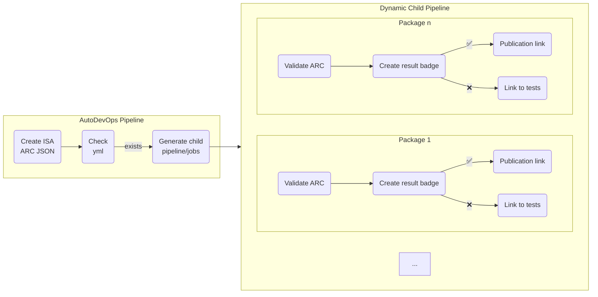

# DataPLANT ARC Symposium 2024-04-08 - ARC Validation

This document describes the current state of the ARC validation pipeline in DataHUB and what improvements has been done to it during the hackathon. 

## ARC Validation Pipeline

The main pipeline is realized using GitLab's AutoDevOps which is automatically activated for every new ARC created. When the main pipeline is triggered, it calls [arc-export](https://github.com/nfdi4plants/arc-export) to create the isa-arc.json file. This is done as a machine-readable representation of an ARC for external services (e.g. the ARC Registry).

The [ARC validation process](https://github.com/nfdi4plants/ARC-specification/blob/validation-specs/ARC%20specification.md#mechanisms-for-arc-quality-control) starts with the second stage of the main pipeline: it checks for the file `.arc/validation_packages.yml` in the ARC and checks which packages are requested to validate against. If then creates a child pipeline and the different jobs to validate the ARC against each of the configured package (in the figure, Package 1, ... Package n).

The validation jobs create badges which are configured within GitLab to give the user an easy-to-understand feedback. Furthermore, the jobs create a JUnit test report which contains more detailed information on each of the tests - in particular why some might have failed.

Each badge is a clickable link. The link itself is determined according to the result of the validation. If it fails, the link points to the test report page of GitLab. If it succeeds, the link points to whatever service handles the next step for this specific package. For example, to publish the ARC within DataPLANT's publication platform ARChive, the link will point to a middleware (ARChigator) that creates publication requests within ARChive.

Other potential usecases came up in the hackathon. In FAIRaggro, an idea is to track the valid ARCs within DataVerse. This could be achieved by creating a validation package specific to that purpose. While the link to trigger the ingest within DataVerse is still unclear, a similar function used for ARChive would suffice. Furthermore, a integration of the DataHUB and an OMERO instance was envisioned to manage ARCs related to imaging.

On the technical side, the link-handling is done within a bash script in the [DataHUB](https://github.com/nfdi4plants/DataHUB) image. A function is called when the validation succeeds and gets the link to setup in the badge. To make the entire construct more flexible, the bash script was restructured to allow overwriting that function for the different purposes for on-premise DataHUBs. That package-specific function can be injected by mounting `datahub-functions.include` within the container. This allows for on-premise instances to use the base construct of the ARC validation pipeline while being able to adapt to their specific needs. The code for that will be published soon in the DataHUB repository.
