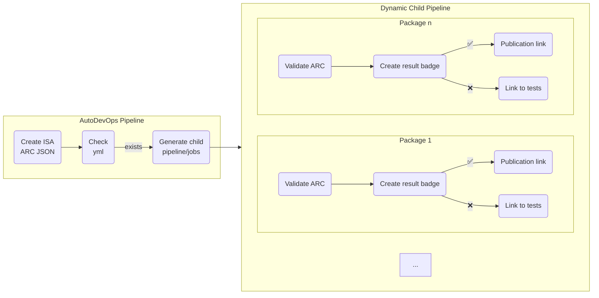

# DataPLANT ARC Symposium 2024-04-08 - ARC Validation

This document describes the current state of the ARC validation pipeline in DataHUB and what improvements has been done to it during the hackathon. 

## Goals

- [x] Identify usecases of the community to integrate the ARC hosted on a DataHUB with other community services.
- [x] Establish concepts and idea on how to implement those based on the base ARC validation structure described below.
- [x] Make the necessary adjustments to the base implementation.

## ARC Validation Pipeline

The main pipeline is realized using GitLab's AutoDevOps which is automatically activated for every new ARC created. When the main pipeline is triggered, it calls [arc-export](https://github.com/nfdi4plants/arc-export) to create the isa-arc.json file. This is done as a machine-readable representation of an ARC for external services (e.g. the ARC Registry).

The [ARC validation process](https://github.com/nfdi4plants/ARC-specification/blob/validation-specs/ARC%20specification.md#mechanisms-for-arc-quality-control) starts with the second stage of the main pipeline: it checks for the file `.arc/validation_packages.yml` in the ARC and checks which packages are requested to validate against. If then creates a child pipeline and the different jobs to validate the ARC against each of the configured package (in the figure, Package 1, ... Package n).

The validation jobs create badges which are configured within GitLab to give the user an easy-to-understand feedback. Furthermore, the jobs create a JUnit test report which contains more detailed information on each of the tests - in particular why some might have failed.

Each badge is a clickable link. The link itself is determined according to the result of the validation. If it fails, the link points to the test report page of GitLab. If it succeeds, the link points to whatever service handles the next step for this specific package. For example, to publish the ARC within DataPLANT's publication platform ARChive, the link will point to a middleware (ARChigator) that creates publication requests within ARChive.

## Usecases & Concepts

Other usecases for integrating ARCs using the validation pipeline were discussed with the community.

[FAIRaggro](https://fairagro.net) plans to track valid ARCs within a [Dataverse](https://dataverse.org) instance for findability. This could be achieved by creating a validation package specific to that purpose. The first step would be to identify the metadata schema required by the Dataverse instance. This schema must then be compared to the ARC metadata stored in the isa-arc.json file in order to be able to create a Dataverse-specific version of an ARC's metadata automatically. This could be either implemented by extending the bash hook script using the include mechanism described below (1) or by a dedicated microservice that would receive the "ARC valid" event and infer the metadata required by Dataverse from the isa-arc.json (similar to ARChigator) (2). After the successful validation of an ARC, the badge link could then point to either (1) or (2). It might be worth to evaluate if ARChigator could be extended and be used for this purpose, as the requirements for ARChive are quite similar to the FAIRaggro usecase.

Furthermore, an integration of the DataHUB and [OMERO](https://www.openmicroscopy.org/omero/) instances within the context of [NFDI4BIOIMAGE](https://nfdi4bioimage.de) was discussed. Ideally, it should both be possible to ingest a dataset from OMERO into an ARC on the DataHUB as well as import an ARC into OMERO. Using the ARC validation pipeline, a "load ARC into OMERO" package/badge would be possible. This is problematic however, since a merge conflict might occur if the user changes something in OMERO while the validation process is still running and pushes the ARC back to OMERO once the validation succeed. One solution would be to loosen the requirements and make it one-way only which is not really a good option. Another open question was whether the imaging data in OMERO has to be cloned to the DataHUB or not. If not, one idea could be to just track an ARC's metadata on the DataHUB and keep the imaging data on OMERO. That way, if the ARC's metadata can not be edited in OMERO, such conflicts could never happen (changes to metadata -> DataHUB, changes to data -> OMERO). Other options were not discussed but should be in the future.

The question of the reliability of the event push mechanism of GitLab arose during the discussion. What happens if a event message gets lost? Using microservices somewhat alleviates that problem in that they could implement a message queue and just retry to send the events to the backends in case of a previous transmission failure. But how to garantee that the initial push from GitLab is indeed reliable? There might already be some mechanism built-in GitLab which we don't know about. This needs further evaluation and discussion in a larger group.

## Implementation
On the technical side, the link-handling is done within a bash script in the [DataHUB](https://github.com/nfdi4plants/DataHUB) image. A function is called when the validation succeeds and gets the link to setup in the badge. To make the entire construct more flexible, the bash script was restructured to allow overwriting that function for the different purposes for on-premise DataHUBs. That package-specific function can be injected by mounting `datahub-functions.include` within the container. This allows for on-premise instances to use the base construct of the ARC validation pipeline while being able to adapt to their specific needs. The code for that will be published soon in the DataHUB repository.
