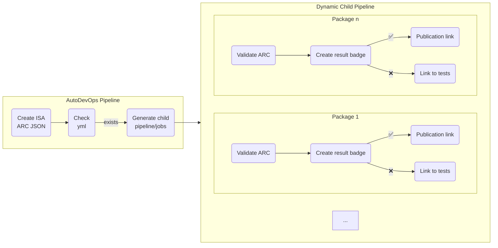

# DataPLANT ARC Symposium 2024-04-08 - ARC Validation

This document describes the current state of the ARC validation pipeline in DataHUB and what improvements has been done to it during the hackathon. 

## Flowchart

