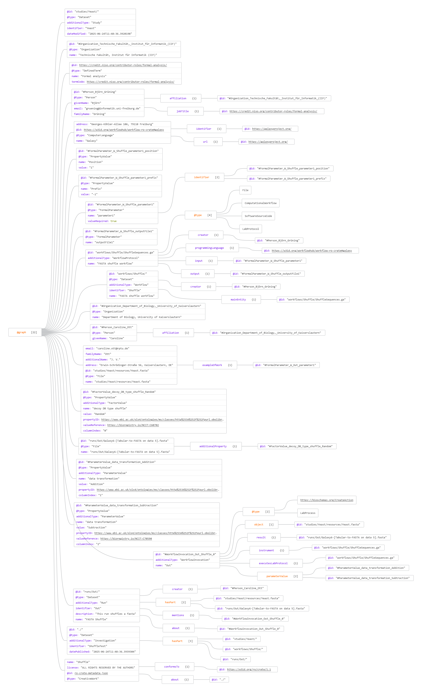

authors:
  - name: Caroline Ott
    orcid: [0000-0002-6601-2165](https://orcid.org/0000-0003-1512-9504)
    affiliation: 1
affiliations:
  - name: Computational Systems Biology, Rheinland-Pfälzische Technische Universität Kaiserslautern-Landau, Kaiserslautern, Germany
    index: 1

# ARC Workflow Run RO-Crate Profile integration with Galaxy

## Motivation or Explanation of the Problem

Research Object Crates (RO-Crates), specifically **Workflow RO-Crates** and **Workflow Run RO-Crates**, are essential standards for capturing and exchanging metadata about workflows and their executions. Similarly, [ARCs](https://arc-rdm.org/) use RO-Crate profiles designed to be compatible with the existing [Workflow Run RO-Crate](https://www.researchobject.org/workflow-run-crate/) and [Workflow RO-Crate](https://about.workflowhub.eu/Workflow-RO-Crate/) specifications. This compatibility is ensured when profile recommendations are followed.

One goal is, that ARCs which include [Galaxy](https://galaxyproject.org/) workflows, should be convertable to **Workflow and Workflow Run RO-Crates** that they can be imported and executed by Galaxy. While profile descriptions exist ([see example profile](https://github.com/nfdi4plants/arc-wr-ro-crate-profile/blob/harmonize/profile/arc_wr_ro_crate.md)), practical examples are lacking.

Additional technical challenges include:

* ARC workflow descriptions in the scaffold representation use `.cwl` wrappers for Galaxy workflows. These wrappers are not intended to appear in the resulting RO-Crate, since Galaxy is the relevant workflow engine.
* The current profiles lack position and prefix information for workflow inputs in their JSON-LD representations.
* Process sequences in ARCs may reuse inputs also specified as workflow run invocations, so it must be clear which elements in the process sequence also map to workflow inputs.

---

## Proposed Solution with Discussion of Constraints

* To encode position and prefix information for workflow inputs, the `identifier` property of the `FormalParameter` type is extended:

  * The `identifier` is now restricted to a `PropertyValue` with the following properties:

    * `name`: either `Prefix` or `Position`
    * `value`: a string (for prefix, e.g. `-i`) or integer (for position, e.g. `1`)
* The `.cwl` wrappers used by ARCs are **omitted** from the RO-Crate, so that only the underlying Galaxy workflow is described and imported. This omission should be detected automatically (though currently requires manual handling).
* For workflow runs with `ProcessSequences`, it is necessary to determine which process sequence inputs are potentially also used as actual workflow inputs. To enable this, workflow inputs use the `exampleOfWork` property, referencing the ID of the corresponding `FormalParameter` describing the workflow input.
* The `programmingLanguage` property is used to indicate the workflow language and serves as a marker within the RO-Crate for conversion back to the scaffold representation.

---

## Technical Details on Implementation

#### Property Restriction for `FormalParameters` `identifier` property in Workflow Inputs

**Prefix Encoding**

| Property | Required | Required Value | Description                   |
| -------- | -------- | -------------- | ----------------------------- |
| name     | MUST     | 'Prefix'       | Indicates the prefix property |
| value    | MUST   | -              | Prefix string (e.g. "-i")     |

**Position Encoding**

| Property | Required | Required Value | Description                     |
| -------- | -------- | -------------- | ------------------------------- |
| name     | MUST     | 'Position'     | Indicates the position property |
| value    | MUST   | -              | Position integer (e.g. 1)       |

* The `identifier` property itself and prefix or position are still optional

### Implementation Notes

* **Automatic Detection:**
  The process of identifying and omitting `.cwl` wrappers in favor of Galaxy workflows is currently a manual step. Future work will focus on automating this detection within ARC export tooling.
* **Workflow Language Marker:**
  The `programmingLanguage` property specifies the workflow language in use (e.g., Galaxy, CWL) and can be used to filter or identify workflow types within RO-Crates. It also enables conversion back to ARCs scaffold representation.
* **Mapping Process Sequence to Inputs:**
  Workflow inputs using the `exampleOfWork` property reference the `FormalParameter` they instantiate. This allows to distinguish inputs of the `ProcessSequence` from actual workflow inputs.

---

## Example

## References

* [RO-Crate Workflow Run Specification](https://www.researchobject.org/workflow-run-crate/)
* [WorkflowHub Workflow RO-Crate](https://about.workflowhub.eu/Workflow-RO-Crate/)
* [ARC WR RO-Crate Profile (GitHub)](https://github.com/nfdi4plants/arc-wr-ro-crate-profile/blob/harmonize/profile/arc_wr_ro_crate.md)
* [ARC-RDM Project](https://arc-rdm.org/)
