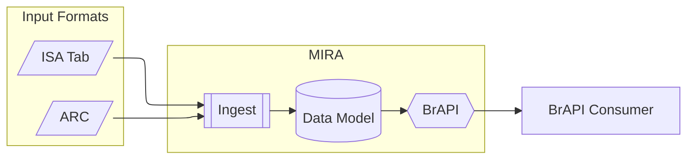

# MIAPPE compliant ARCs as BrAPI Servers

Goal of this project is to extend MIRA to support ARC/RO-Crate as input format. MIRA takes a MIAPPE compliant ISArchive as input and, using the mapping between ISA, MIAPPE and BrAPI, deploys automatically a BrAPI Server for the relevant BrAPI endpoints.

To achieve this, MIRA is redesigned to have an ingestion process for each input format. The BrAPI endpoints will then be implemented on top of the internal database.

## References 

- [Website](https://mira.ipk-gatersleben.de)
- [Demonstrator](https://mira.ipk-gatersleben.de/bridge)
- [Documentation](https://mira-server.rtfd.io/)
- [Github Repo](https://github.com/IPK-BIT/mira)